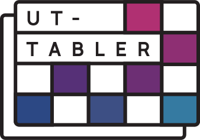

# UT-Tabler
Create optimal University of Toronto schedules based on your desired courses and preferences!
All you need to do is enter the courses you'd like to take, rank your schedule preferences (i.e. minimizing distance between buildings, or avoiding morning/evening classes), and hit submit—the program will then generate up to 15 optimized timetables, from which you can select the one that suits your needs the most!

### Dependencies
- pyQt5
- PyQtWebEngine
- openpyxl
- xlsx2html

### Screenshots
[WIP]
